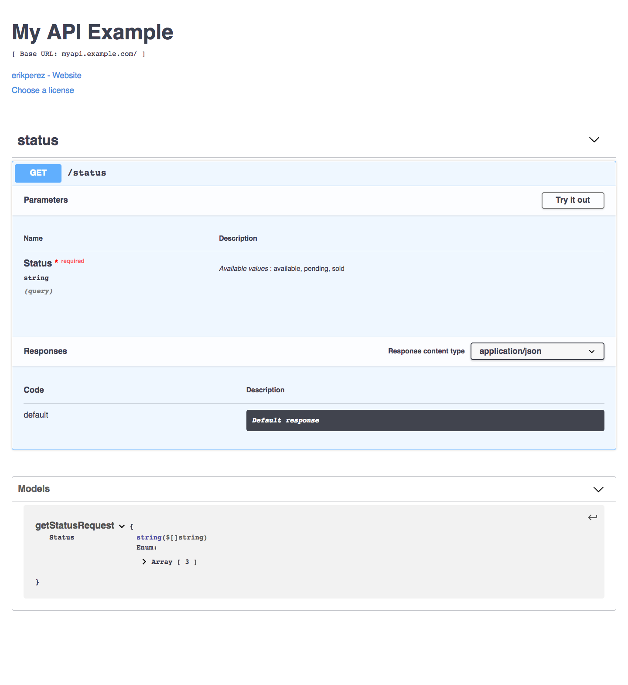

# go-swaggerize
A simple converter that takes a defined route with a struct swaggerizes it into a Swagger 2.0 valid `swagger.json`

[](https://circleci.com/gh/erikperez/go-swaggerize/tree/master)

## Swagger spec support
| Field Name  | Type   | Support  |
|---|---|---|
|swagger|string|x|
|info|info object|x|
|host|string|x|
|basePath|string|x|
|schemes|\[string\]|x|
|consumes|\[string\]|x|
|produces|\[string\]|x|
|paths|paths object|x|
|definitions|definitions object|x|
|parameters|parameters definitions object|x|
|responses|response definitions object|x|
|securityDefinitions|security definitions object||
|security|\[security requirement object\]||
|tags|\[tag object\]|x|
|externalDocs|external documentation object|x|

Further info can be found here: https://swagger.io/specification/v2/


## Features
* Gives you the Swagger 2.0 resource `swagger.json`
* Supports the following swagger elements:
* * Hostname
* * BaseURL
* * License
* * Contact
* * Tags
* * Routes
* * * Supports defining requests with the HTTP verbs: GET, POST, PUT, DELETE
* * * Supports defining request models using structs
* * * Supports defining response models using structs
* * Define struct properties to be used using swagger tags

### Example of how to define a struct with swagger tags
```
type getStatusRequest struct {
	Status []string `json:"status" swagger:"required:true;in:query;multiple:true;enum:['available','pending','sold']"`
}
```

### Supported struct tags
* required
* in
* multiple
* enum
* name

### Working example
```
swag := swagger.NewSwagger("api.example.com", "/v1")
	swag.SetInfo(&swagger.SwaggerInfo{
		Title: "My API Example",
		License: &swagger.SwaggerLicense{
			Name: "Choose a license",
			URL:  "https://choosealicense.com/",
		},
		Contact: &swagger.SwaggerContact{
			Name: "erikperez",
			URL:  "github.com/erikperez",
		},
	})

	routes := []SwaggerizeRoute{}
	routes = append(routes, SwaggerizeRoute{
		Group: "status",
		Route: "/status",
		Verb:  "get",
		Model: getStatusRequest{},
	})

	o, err := Swaggerize(swag, routes)
	//o is now your swagger.json
```


